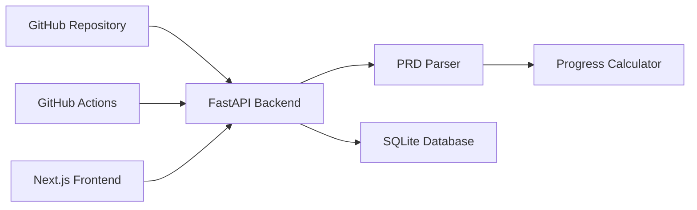

# Component Diagram

```mermaid
flowchart LR
    GitHub["GitHub Repository"] --> Backend["FastAPI Backend"]
    Actions["GitHub Actions"] --> Backend
    Backend --> Parser["PRD Parser"]
    Parser --> Calculator["Progress Calculator"]
    Backend --> DB["SQLite Database"]
    Frontend["Next.js Frontend"] --> Backend
```
