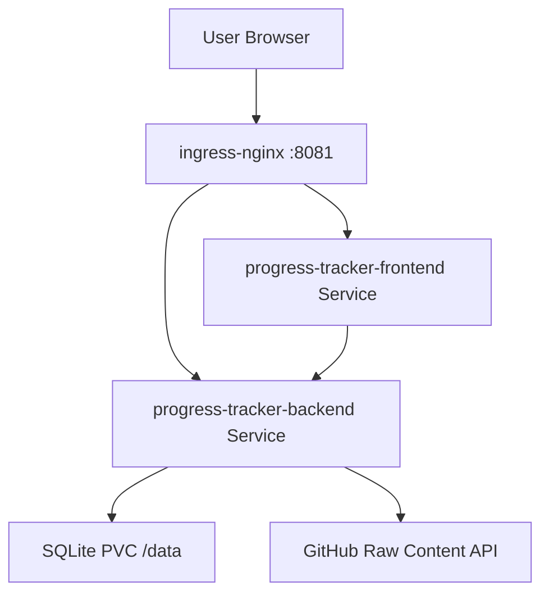

# Deployment Diagram

```mermaid
flowchart TB
    Browser["User Browser"] --> Ingress["ingress-nginx :8081"]
    Ingress --> Web["progress-tracker-frontend Service"]
    Ingress --> API["progress-tracker-backend Service"]
    Web --> API
    API --> DB["SQLite PVC /data"]
    API --> GitHub["GitHub Raw Content API"]
```
