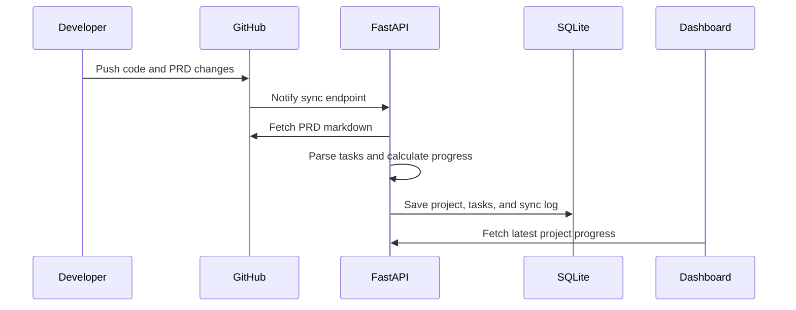

# Sequence Diagram

```mermaid
sequenceDiagram
    participant Dev as Developer
    participant GH as GitHub
    participant API as FastAPI
    participant DB as SQLite
    participant UI as Dashboard

    Dev->>GH: Push code and PRD changes
    GH->>API: Notify sync endpoint
    API->>GH: Fetch PRD markdown
    API->>API: Parse tasks and calculate progress
    API->>DB: Save project, tasks, and sync log
    UI->>API: Fetch latest project progress
```
